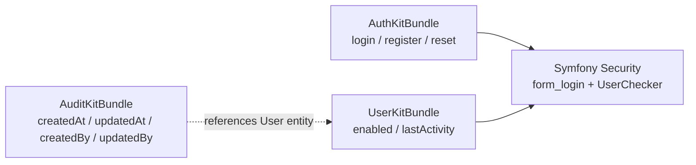

# Spec-driven development — UserKitBundle

**Status:** Specification phase (2026-07-14)

This repository follows the Nowo bundle **spec-driven development** model in three layers:

1. **Baseline spec** — [`specs/001-baseline/spec.md`](../specs/001-baseline/spec.md) and [`code-inventory.md`](../specs/001-baseline/code-inventory.md).
2. **Integrator docs** — `docs/INSTALLATION.md`, `CONFIGURATION.md`, `USAGE.md` (to be added at implementation).
3. **Mechanical proof** — PHPUnit 100% coverage, PHPStan, CI (to be added at implementation).

---

## Bundle functional scope

**Goal:** User account state (enable/disable blocking login) and optional last-activity / online presence.

### In scope

- `UserChecker` for disabled accounts (blocks login even with valid password).
- Configurable `enabled` field on the user entity.
- Optional `lastActivityAt` tracking with write throttle.
- `online_threshold` and `UserPresenceResolver`.
- Optional session invalidation when disabling an account.
- Traits and interfaces for application entities.
- Coexistence documentation with **AuthKitBundle** (same `user_class`, no hard dependency).

### Explicit non-goals

- Login/register/reset UI or routes → **AuthKitBundle**.
- Login rate limiting → **LoginThrottleBundle**.
- `createdAt`, `updatedAt`, `createdBy`, `updatedBy` on arbitrary entities → **AuditKitBundle**.
- Admin CRUD for users.
- WebSocket / real-time presence.

---

## User stories (backlog)

| ID | Story |
| --- | --- |
| US-01 | **As a** site admin, **I want** disabled users to be rejected at login **so that** revoked access is enforced immediately. |
| US-02 | **As an** integrator, **I want** a configurable enabled field **so that** I am not forced to rename my entity property. |
| US-03 | **As a** product owner, **I want** last-activity tracking **so that** I can show “online” status in admin UIs. |
| US-04 | **As an** integrator using AuthKit, **I want** UserKit to plug in via UserChecker only **so that** I do not duplicate auth flows. |
| US-05 | **As a** security engineer, **I want** optional session invalidation on disable **so that** active sessions cannot continue after ban. |

Full acceptance criteria: [`spec.md`](../specs/001-baseline/spec.md).

---

## Ecosystem placement

---

## Validating the spec (when implemented)

- `make test-coverage-100` / `composer qa`
- Demo with AuthKit: login blocked when `enabled: false`
- Inventory: every file under `src/` mapped in `code-inventory.md`

---

## Version roadmap

See **Version roadmap** section in [`spec.md`](../specs/001-baseline/spec.md).

**MVP (v1.0.0):** US-01, US-02, US-03, US-04, US-06 (account status + checker + traits + i18n).

**v1.1.0:** Last activity + online threshold.

**v1.2.0:** Session invalidation + Twig helper.
